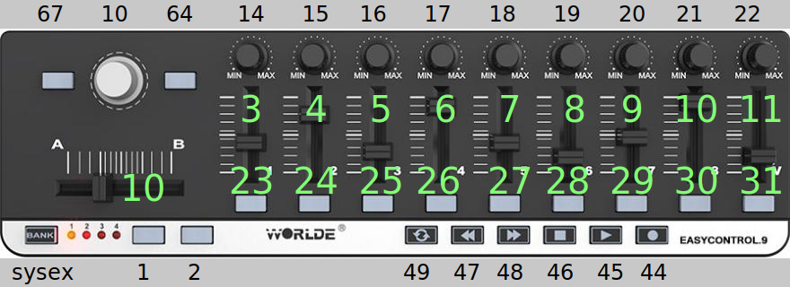

# knobs
ham radio knobs over usb

## WORLDE EASYCONTROL.9

WORLDE easy control:WORLDE easy control MIDI 1 28:0

### Inputs



### dmesg -w

```
[ 9734.013295] usb 1-2.3.1: new full-speed USB device number 13 using xhci_hcd
[ 9734.128554] usb 1-2.3.1: New USB device found, idVendor=0218, idProduct=0402, bcdDevice= 0.00
[ 9734.128558] usb 1-2.3.1: New USB device strings: Mfr=1, Product=2, SerialNumber=0
[ 9734.128559] usb 1-2.3.1: Product: WORLDE easy control
[ 9734.128560] usb 1-2.3.1: Manufacturer: **
```
